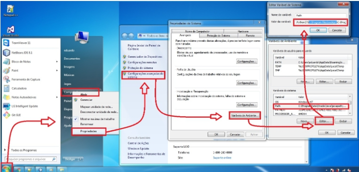

## Projeto: testes automatizados na aplicação Bank com Selenium WebDriver

#### Técnicas para testar a aplicação

Para validar um sistema com inumeros cenários de teste como neste caso, é preciso ganhar velocidade, mas sem abrir mão também da qualidade. Os testes que vou apresentar são apenas para demostrar como tirar proveito das técnicas de BDD e posteriormente apresentarei o desenvolvimento em selenium.

##### Breve apresentação da aplicação 

###### tela de Transações da aplicação 

## uma visão sobre o BDD como isso vai ajudar nos testes.
BDD é uma técnica de desenvolvimento de software ágil que surge através de uma crítica de Dan North ao Test Driven Development(Desenvolvimento orientado a testes), onde ele visava otimizar o conceito de ‘verificação e validação’ já aplicado, e tornar mais eficiente a construção de cenários a serem testados e/ou desenvolvidos.

### Cenários de BDD's usados como guia para o desenvolvimento da automação

### Como fica após atomatizar com Selenium e JUnit 
##### Onde tem "@Test" sinaliza uma anotação para executar nosso teste

### Ferramentas utilizadas para os testes

#### Intalações necessarias para esse projeto

Java versão 8 Update 261r

IntelliJ IDEA Community Edition 2020.14

ChromeDriver

#### Lembrar de configurar as variáveis de ambiente

#### Características do Selenium WebDriver:

A API Selenium WebDriver tem como principal objetivo automatizar ações do navegador, tais como submits de formulários, seleções em menus dropdown, digitação em campos texto, varredura de dados em elementos, HTML etc. Para entender melhor seus conceitos, a seguir, detalharemos algumas interfaces e outras classes principais que compõem o Selenium WebDriver.

#### Características do JUnit: 
Origem: Wikipédia, a enciclopédia livre.

Saltar para a navegaçãoSaltar para a pesquisa
O JUnit é um framework open-source, que se assemelha ao raio de testes software java, criado por Erich Gamma e Kent Beck, com suporte à criação de testes automatizados na linguagem de programação Java.

Esse framework facilita a criação e manutenção do código para a automação de testes com apresentação dos resultados. Com ele, pode ser verificado se cada método de uma classe funciona da forma esperada, exibindo possíveis erros ou falhas podendo ser utilizado tanto para a execução de baterias de testes como para extensão.

Com JUnit, o programador tem a possibilidade de usar esta ferramenta para criar um modelo padrão de testes, muitas vezes de forma automatizada.

O teste de unidade testa o menor dos componentes de um sistema de maneira isolada. Cada uma dessas unidades define um conjunto de estímulos (chamada de métodos), e de dados de entrada e saída associados a cada estímulo. As entradas são parâmetros e as saídas são o valor de retorno, exceções ou o estado do objeto. Tipicamente um teste unitário executa um método individualmente e compara uma saída conhecida após o processamento da mesma.

## Comandos Selenium WebDriver

	// Fecha a janela corrente.
	driver.close();

	// Encontra o primeiro elemento de uma tela HTML através de um dado argumento.
	driver.findElement(By by);

	// Encontra todos os elementos de uma tela HTML através de um dado argumento.
	driver.findElements(By by);

	// Abre uma nova URL no navegador.
	driver.get();

	// Retorna uma string que contém a URL aberta pelo navegador.
	driver.getCurrentUrl();

	// Retorna o código fonte da última página aberta pelo navegador.
	driver.getPageSource();

	// Retorna o título da página aberta pelo navegador.
	driver.getTitle();

	// Retorna um identificador da janela em questão.
	driver.getWindowHandle();

	// Retorna identificadores que podem ser utilizados para movimentação entre janelas.
	driver.getWindowHandles();

	// Envia comandos futuros para uma janela (ou frame) diferente.
	driver.switchTo();

	// Permite gerenciar cookies do navegador, logs, timeouts etc.
	driver.manage();

	// Abstração que permite acessar o histórico e navegar para uma determinada URL.
	driver.navigate();

	// Fecha a instância do Selenium WebDriver e todas os navegadores associados.
	driver.quit();

## Instalação através do gerenciador de dependências Maven: 

Utilizei o Maven para facilitar a vida, ele vai cuidar da parte de gerenciamento de dependências. 

Incluir as dependências do WebDriver, do JUnit e do AssertJ no pom.xml como mostro abaixo:

## Algumas vantagens de se utilizar JUnit:
Permite a criação rápida de código de teste enquanto possibilita um aumento na qualidade do sistema sendo desenvolvido e testado;
Não é necessário escrever o próprio framework;
Amplamente utilizado pelos desenvolvedores da comunidade código-aberto, possuindo um grande número de exemplos;
Uma vez escritos, os testes são executados rapidamente sem que, para isso, seja interrompido o processo de desenvolvimento;
JUnit checa os resultados dos testes e fornece uma resposta imediata;
Pode-se criar uma hierarquia de testes que permitirá testar apenas uma parte do sistema ou todo ele;
Escrever testes com JUnit permite que o programador perca menos tempo depurando seu código;
JUnit é LIVRE.

## Links 

	devmedia.com.br   https://www.devmedia.com.br/introducao-aos-testes-funcionais-automatizados-com-junit-e-selenium-webdriver/28037
	junit.org         https://junit.org/junit5/docs/current/user-guide/
	wikipedia.org     https://pt.wikipedia.org/wiki/JUnit
        Lucas G. Carvalho https://medium.com/editora-globo/introdu%C3%A7%C3%A3o-ao-selenium-webdriver-8ac2f9a8d9d0
        Babiana Mugnol    pioneiro.clicrbs.com.br/rs/economia/caixa-forte/noticia/2020/08/idealizadores-de-franquia-nacional-com-novo-sonho-13001085.html
    Banking http://www.way2automation.com/angularjs-protractor/banking/#/listTx

	
	
 
